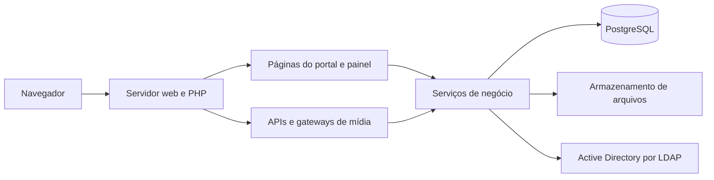
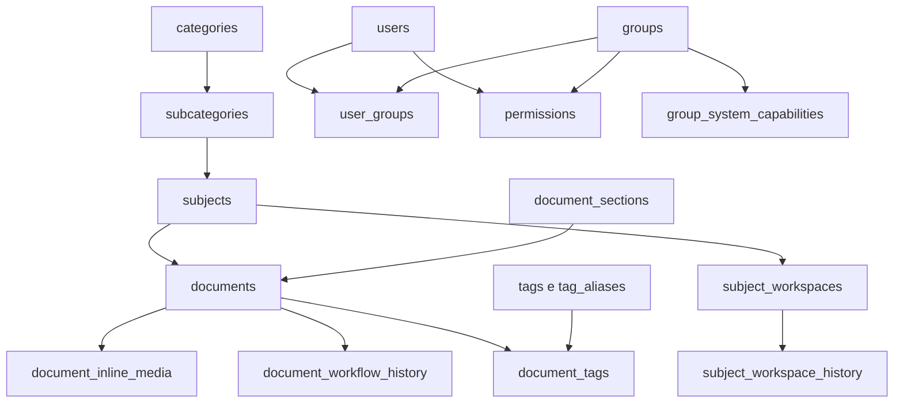

# Arquitetura do DocGov

Levantamento inicial em 01/10/2026. Descreve o código inspecionado, sem validação da topologia do servidor publicado.

## Componentes e requisições

O sistema é um monólito PHP com múltiplos pontos de entrada. As páginas montam HTML, chamam serviços e consultam o PostgreSQL. As APIs retornam JSON e compartilham os mesmos serviços de autorização. O frontend utiliza JavaScript convencional e bibliotecas de edição/visualização.

O bootstrap usual carrega `config/session.php`, inicia a sessão e inclui `config/db.php`. A conexão carrega `config/app_runtime.php`, salvo quando `DOCGOV_SKIP_APP_RUNTIME` é definido como `true` por um executor. O runtime obtém configurações, aplica políticas de sessão, headers, manutenção e expiração editorial.

Isso torna a inclusão da conexão uma operação com efeitos adicionais: no contexto web, pode atualizar documentos vencidos e encerrar/redirecionar a requisição por manutenção. Um script que apenas inclui `db.php` não deve ser tratado automaticamente como consulta sem escrita.

## Mapa dos serviços

| Área | Fonte principal | Responsabilidade |
| --- | --- | --- |
| Autorização de conteúdo | `PermissionService.php` | Acesso efetivo, herança, árvore e escopo administrativo |
| Compatibilidade de acesso | `AccessService.php` | Encaminha chamadas ao motor de permissões |
| Módulos administrativos | `SystemAccessService.php` | Capacidades globais delegadas por equipes |
| Identidade corporativa | `ActiveDirectoryAuthService.php` | Autenticação, consulta ao AD, contas e auditoria de autenticação |
| Configuração | `SystemSettingsService.php` | Configurações JSONB e status de manutenção |
| Fluxo editorial | `DocumentWorkflowService.php` | Transições, metadados, histórico, expiração e avisos |
| Conteúdo e seções | `DocumentSectionService.php`, `RichTextSanitizer.php`, `StructuredContentService.php` | Seleção de editor e validação do conteúdo |
| Upload e identidade do documento | `BatchDocumentUploadService.php`, `DocumentSlugService.php` | Lote de arquivos e reserva de slug |
| Mídia | `DocumentInlineMediaService.php`, `CategoryImageService.php`, `VideoEmbedService.php` | Imagens internas, imagens da estrutura e vídeo externo |
| Processo do assunto | `SubjectWorkspaceService.php` | Seções estruturadas, aprovação e snapshots |
| Estrutura | `HierarchyService.php`, `StructureArchiveService.php`, `StructureDeletionService.php` | Resolução da hierarquia, arquivamento e exclusão permanente |
| Organização e rastreio | `TagService.php`, `NotificationService.php`, `UsageAuditService.php` | Tags, notificações e eventos de uso |

Os caminhos da tabela são relativos a `services/`. A importação em lote de usuários observada durante a varredura ainda estava em alteração local; seu contrato precisa de revisão posterior.

## Dados

`database/schema.sql` representa a estrutura para instalação em uma base vazia. As migrações versionadas representam a evolução de bases existentes.

Outras tabelas incluem `favorites`, `notifications`, `system_settings`, `permission_audit`, `system_capability_audit` e `usage_audit_events`. Consulte as migrações para a evolução da auditoria AD. Os arquivos físicos não são armazenados como bytes no banco; o banco guarda identificação, vínculo e metadados.

## Autorização

Os níveis hierárquicos são `view < edit < admin`. O maior nível recebido diretamente, por equipe ativa ou por ancestral vence. Não há regra explícita de negação; remover uma concessão não elimina outra origem de acesso. Documentos herdam o escopo do assunto.

O administrador global é identificado pelo papel armazenado no banco. O runtime e os serviços verificam a atividade do usuário e o contexto do recurso. Ancestrais exibidos na navegação não representam concessão herdável de escrita.

Assuntos públicos acrescentam leitura a usuários autenticados e ativos, limitada ao conteúdo publicado e à hierarquia ativa. Essa leitura não libera edição, aprovação ou administração. Veja [visibilidade](assuntos-publicos-privados.md).

As capacidades `system.settings.manage`, `system.authentication.manage`, `system.directory.manage`, `system.audit.view` e `system.tags.manage` são separadas das permissões de conteúdo. Apenas o administrador global modifica as capacidades e a gestão de equipes.

## Dois fluxos de aprovação

| Entidade | Estados | Particularidades |
| --- | --- | --- |
| Documento | `draft`, `review`, `published`, `inactive` | Revisão concluída é um metadado; aprovação exige documento em revisão e revisor registrado |
| Workspace do assunto | `draft`, `review`, `approved`, `deprecated` | Valida prontidão, guarda histórico e permite recuperar snapshot aprovado |

Documentos pendentes podem expirar após o prazo registrado em `approval_expires_at`. `app_runtime.php` chama a expiração em requisições web; não foi identificado um agendador versionado. Sem tráfego, a execução depende de outra integração operacional.

## Arquivos e conteúdo

`download.php`, `document-file.php` e `document-media.php` resolvem o recurso e validam acesso antes de entregar o arquivo. Mídia de artigo é enviada inicialmente sem documento, fica disponível ao autor e é vinculada ao salvar pelo painel. Uploads abandonados são removidos após um dia quando ocorre nova chamada de upload.

A pasta `storage/` possui `.htaccess` para Apache e um `index.php` que responde 403. Esses arquivos não comprovam bloqueio de caminhos individuais em IIS ou no servidor embutido do PHP. O servidor deve impedir acesso direto aos arquivos protegidos.

HTML formatado é filtrado por uma lista de tags, atributos e URLs. Código usa texto e seleção de linguagem; fluxos e organogramas passam por normalização estruturada. O frontend inclui bibliotecas locais e carrega Tailwind por CDN em páginas inspecionadas; não existe comando de build em `package.json`.

## Fronteiras a consolidar

`admin/index.php` concentra controle de ações, consultas e interface em mais de oito mil linhas no levantamento. A API de documentos possui um caminho de persistência paralelo ao painel, com divergências de vínculo de mídia e atomicidade editorial registradas no [code review](CODE_REVIEW_2026-10-01.md). A próxima evolução deve concentrar o salvamento e a transição de documentos em um serviço compartilhado, com regressões antes de mover responsabilidades.
